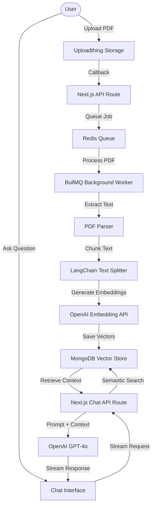

# DocuMind AI — AI-Powered PDF Chat SaaS Platform

DocuMind AI is a production-grade, premium SaaS application designed to help users interact, query, and extract insights from their PDF documents. Powered by Next.js 15+ (App Router), Tailwind CSS v4, MongoDB Vector Search (RAG), and Vercel AI SDK, it provides an intuitive, high-performance, and secure reading and chatting experience.

---

## 🚀 Features

- **📂 Multi-PDF Workspaces**: Group and organize related PDF documents into isolated workspaces. Chat across multiple files simultaneously for comprehensive research.
- **💬 Smart AI Chat (RAG)**: Chat with your PDFs using cutting-edge Retrieval-Augmented Generation (RAG) powered by OpenAI GPT-4o.
- **🔍 Semantic Search & Citations**: Search by meaning rather than simple keywords, with exact page numbers and snippet citations for each AI answer.
- **⚡ Background Processing Queue**: Scalable PDF parsing, text extraction, and embedding generation handled asynchronously using a resilient **BullMQ** worker.
- **🔐 Secure Authentication**: Full user signup, signin, and organization control integrated seamlessly via **Clerk**.
- **🎨 Premium Responsive UI**: Stunning glassmorphism design system featuring smooth framer-motion animations, modern typography, and dark mode support.
- **🧪 Robust Testing Suite**: Fully tested utility functions and core service logic using **Vitest**.

---

## 🛠️ Tech Stack

- **Framework**: [Next.js 16 (App Router)](https://nextjs.org/)
- **Styling**: [Tailwind CSS v4](https://tailwindcss.com/) & [Framer Motion](https://www.framer.com/motion/)
- **Authentication**: [Clerk](https://clerk.com/)
- **Database**: [MongoDB](https://www.mongodb.com/) (Mongoose for Schema & Vector Search)
- **Vector Embeddings**: [OpenAI Text-Embedding-3-Small](https://openai.com/) & [LangChain](https://js.langchain.com/)
- **LLM Streaming**: [Vercel AI SDK v4](https://sdk.vercel.ai/) & OpenAI GPT-4o
- **File Upload**: [Uploadthing](https://uploadthing.com/)
- **Background Queue**: [BullMQ](https://bullmq.io/) with [Redis](https://redis.io/)
- **Testing**: [Vitest](https://vitest.dev/)

---

## 🗺️ Architectural Workflow



---

## ⚙️ Environment Variables Setup

Create a `.env.local` file in the root of the `pdf-chat` directory and configure the following variables:

```env
# Next.js Config
NEXT_PUBLIC_APP_URL=http://localhost:3000

# MongoDB Configuration
MONGODB_URI=mongodb+srv://<username>:<password>@cluster.mongodb.net/documind
MONGODB_DB_NAME=documind

# Upstash Redis / Local Redis (For BullMQ & Rate Limiting)
REDIS_URL=redis://localhost:6379
UPSTASH_REDIS_REST_URL=https://<your-redis-instance>.upstash.io
UPSTASH_REDIS_REST_TOKEN=<your-upstash-token>

# Clerk Authentication Keys
NEXT_PUBLIC_CLERK_PUBLISHABLE_KEY=pk_test_...
CLERK_SECRET_KEY=sk_test_...
NEXT_PUBLIC_CLERK_SIGN_IN_URL=/sign-in
NEXT_PUBLIC_CLERK_SIGN_UP_URL=/sign-up

# Uploadthing File Storage Keys
UPLOADTHING_SECRET=sk_live_...
UPLOADTHING_APP_ID=<your-uploadthing-app-id>

# OpenAI API Key
OPENAI_API_KEY=sk-proj-...
```

---

## 🏃 Local Run & Development

### 1. Prerequisites
Ensure you have **Node.js v18+**, **MongoDB**, and **Redis** (either local or cloud-hosted instances) set up.

### 2. Install Dependencies
```bash
npm install
```

### 3. Run Development Servers

Since the project uses customized Webpack configurations (for handling native Node.js parser integrations like `pdf-parse`), you need to run the application using the `--webpack` builder option.

Start the Next.js development server:
```bash
npm run dev
```

In a separate terminal tab, run the **BullMQ Background Worker** to process uploads:
```bash
npm run worker
```

The application will be running at [http://localhost:3000](http://localhost:3000).

---

## 🧪 Running Tests

We use **Vitest** for fast unit testing. To run the tests:

```bash
# Run tests once
npm run test

# Run tests in watch mode
npm run test:watch
```

---

## 📂 Project Directory Structure

```text
pdf-chat/
├── public/                 # Static assets
├── src/
│   ├── app/                # Next.js Pages & Router
│   ├── components/         # Reusable React components (Chat, PDFs, Uploaders, Sidebar)
│   ├── constants/          # Application global constants
│   ├── lib/                # DB connections, Redis, OpenAI configs
│   ├── queues/             # BullMQ queue configurations
│   ├── services/           # Backend services (AI generation, embeddings, PDF processing)
│   ├── types/              # TS interface definitions
│   ├── utils/              # Helper utilities (tailwind-merge class joiners, etc.)
│   ├── workers/            # Background worker threads for PDF processing
│   └── middleware.ts       # Clerk route protection & auth redirects
├── tests/                  # Test suites (Unit & E2E)
├── unused/                 # Local archive folder (ignored by Git)
├── tsconfig.json           # TS configuration
├── next.config.ts          # Next.js configurations
└── package.json            # Script definitions and package dependencies
```

---

## 📄 License
This project is licensed under the MIT License.
